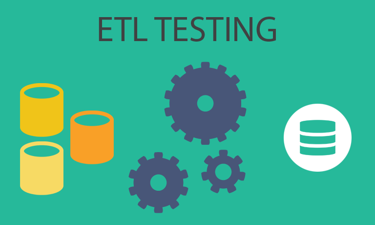

# Проектный практикум, 3 семестр Группа 20 (pi)


## Описание
Данный проект направлен на разработку алгоритма и программы для оценки технологического риска внедрений релизов программного обеспечения, предназначенного для выполнения процедур трансформации данных (ETL) и расчетов на витринах хранилища данных (DWH). Проект использует риск-ориентированный подход для оптимизации процесса тестирования и снижения затрат.

## Установка

1. Клонируйте репозиторий:
   ```bash
   git clone https://github.com/ChristopherMcCandless/group_pi_20.git
   ```
2. Установите необходимые зависимости:
    ```bash
    pip install -r requirements.txt
    ```
3. Запустите сервер:
    ```bash
    python src/web/main.py
    ```
4. Откройте файл `src/web/index.html` с помощью браузера


## Использование

### Добавление релиза
    - Перейдите на страницу "Releases" и нажмите кнопку "Add Release".
    - Заполните форму с параметрами релиза и нажмите "Submit".

### Предсказание рисков
    - На странице "Releases" выберите релиз и нажмите кнопку "Select".
    - Нажмите кнопку "Calculate Risk" для получения предсказания рисков.

## Структура проекта
```
/group_pi_20
│
├── /src
│   ├── /models          # Модели и скрипты для предсказания рисков
│   ├── /web             # Веб-приложение на Flask
│   └── /data            # Данные для обучения модели
│
├── example.db           # База данных SQLite
├── requirements.txt     # Зависимости проекта
└── README.md            # Этот файл
```

## Состав команды
    Аналитик данных, подготовка датасетов – Кузнецов Иван
    Руководитель проекта - Красильников Михаил
    Full Stack-разработчик – Казанцев Александр
    Тестировщик – Табакарь Сергей
    Документалист/технический писатель – Граб Яков 

## Лицензия
    Python Software Foundation License
